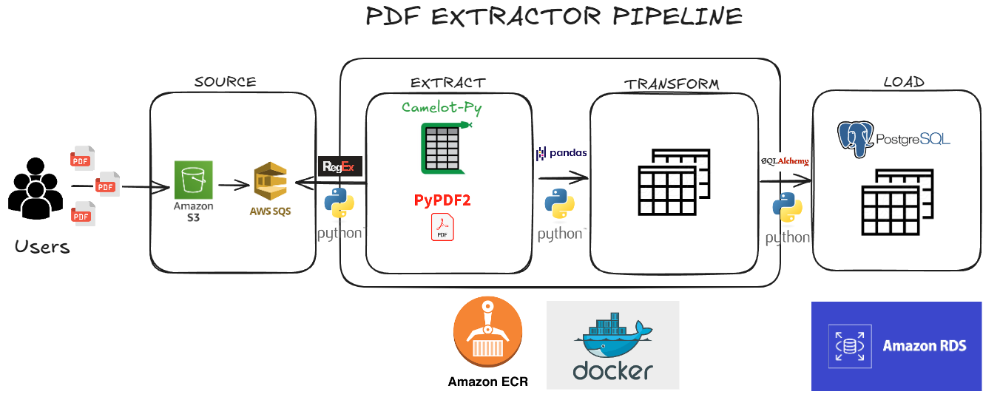

# PDF Extraction Pipeline

This repository hosts an end-to-end project designed for automated text extraction from PDF files. The pipeline is triggered by new PDF uploads to an AWS S3 bucket.

## How it Works

1. **PDF Upload:** When a new PDF is uploaded to a designated AWS S3 bucket, a message is automatically sent to an Amazon SQS queue.
2. **Pipeline Initiation:** Our system monitors the SQS queue. Upon receiving a message, the pipeline initiates.
3. **PDF Download & Text Extraction:** The PDF associated with the SQS message is downloaded, and its text content is extracted.
4. **Database Storage:** The extracted text is then saved into a PostgreSQL database.
5. **Cleanup:** If the extraction and storage process is successful, the original PDF is deleted from S3, and the message is removed from the SQS queue. This process repeats for every new PDF file added to the S3 bucket.



## Architecture Details

1. **SOURCE**
    - **Users/Systems:** Represents the entities (users or other systems) responsible for uploading PDF files.
    - **PDF Files:** The raw PDF documents that will be processed by the pipeline.
    - **Amazon S3:** AWS's object storage service. PDFs are uploaded to an S3 bucket, serving as the primary entry point for raw data into the pipeline.
    - **AWS SQS (Simple Queue Service):** Upon a successful PDF upload to S3, a message is automatically sent to an SQS queue. This is critical for decoupling the upload process from the pipeline execution, ensuring scalability and resilience. If the processing service is busy, the message will wait in the queue.
2. **EXTRACT**
    - **Python:** The primary programming language used to interact with SQS, download PDFs from S3, and orchestrate the extraction process.
    - **Camelot-Py & PyPDF2:** Python libraries for PDF manipulation.
    - **Camelot-Py:** Specialized in extracting tabular data from PDFs, suggesting that your PDFs may contain structured data in tables.
    - **PyPDF2:** A more general-purpose library for working with PDFs, including text extraction, splitting/merging pages, etc.
3. **TRANSFORM**
    - **Pandas:** A widely used Python library for data manipulation and analysis. This indicates that after extraction, the raw data (whether tables from Camelot or text from PyPDF2) will be loaded into pandas DataFrames.
    - **Python:** Again, Python orchestrates the transformation operations.
    - **Transformed Output:** The structured table representation suggests that pandas will be used to clean, format, validate, and potentially aggregate the extracted data, preparing it for storage in the database. Examples include type conversion, column renaming, handling missing values, etc.
4. **LOAD**
    - **SQLAlchemy:** A Python ORM (Object Relational Mapper) and database toolkit. SQLAlchemy is used to interact with the PostgreSQL database, enabling the transformed data to be easily inserted or updated.
    - **Python:** The language responsible for orchestrating the data loading.
    - **PostgreSQL:** The relational database management system where the final, structured data will be stored.
5. **Additional Components (Underneath the Pipeline)**
    - **Amazon ECR (Elastic Container Registry):** A fully managed Docker container image registry service. The Python applications (for extraction, transformation, and loading) will be packaged as Docker images.
    - **Docker:** The containerization platform. Confirms that the applications will run inside Docker containers, which is excellent for ensuring environment consistency, isolation, and portability.
    - **Amazon RDS (Relational Database Service):** A managed relational database service by AWS. This implies that PostgreSQL will be deployed as an RDS instance, offering high availability, automated backups, scalability, and reduced operational overhead.
---

## How to Run This Project

This section guides you through setting up and running the project using a `bash` terminal.

### Prerequisites
- [`pyenv`](https://github.com/pyenv/pyenv) - Python version management
- [`poetry`](https://python-poetry.org/) - Dependency management
- [`docker`](https://www.docker.com/) - Containerization
- [`awss3`](https://aws.amazon.com/s3/) - Object storage
- [`awssqs`](https://aws.amazon.com/sqs/) - Message queuing
- [`awsecr`](https://aws.amazon.com/ecr/) - Container registry
- [`awsiam`](https://aws.amazon.com/iam/) - Identity and access management
- [`awsvpc`](https://aws.amazon.com/vpc/) - Virtual private cloud
- [`awsrds`](https://aws.amazon.com/rds/) - Relational database service
- [`awscli`](https://aws.amazon.com/cli/) - Command line interface for AWS

### Setup Instructions

1. **Clone the Repository**

    ```bash
    git clone https://github.com/rafaelpanegassi/pdf-extractor-with-regex.git
    ```

    ```bash
    cd pdf-extractor-with-regex
    ```

2. **Configure Environment Variables**

    - Create a .env file in the project root based on .env-example.
    ```
    DB_NAME=
    DB_USER=
    DB_PASSWORD=
    DB_HOST=

    AWS_BUCKET=""
    AWS_REGION=
    AWS_ACCESS_KEY_ID=
    AWS_SECRET_ACCESS_KEY=

    QUEUE_NAME=
    ```

3. **Set Python Version**

    - Set the Python version with `pyenv`:
    ```bash
    pyenv local 3.13.0
    ```

4. **Set Up Virtual Environment**

    - Create the virtual environment:
    ```bash
    poetry env use 3.13.0
    poetry shell
    poetry install
    ```
5. **Run Upload Docker in AWS ECR**

    - At root directory run bash:
    ```bash
    make deploy
    ```

6. **Access Database Service**
    - PostgreSQL: `meu-banco.xxxxxxxxxxxx.us-east-1.rds.amazonaws.com`

### Manual Execution

To run the pipeline manually local, follow these step:

1. **Extract, Transfom and Load Data**

    - Scrapes data from ANTAQ and stores it in the Raw layer.

    ```bash
    poetry shell
    python src/__init__.py
    ```

### Project Structure
- `src/` - Scripts for the pipeline extract text and tables from PDF files.
- `img/` - Architecture diagram.
- `src/configs/tools` - Files to configure postgres and queue.
- `src/configs/tools/aws` - Files to configure AWS services.
- `src/configs/rules` - Configuration files for the rules used in the pipeline.
- `.env-example` - Template for environment variables.
- `Makefile` - Contains commands to deploy the project.
- `docker/` - Dockerfile and docker-compose files for application.

### Future Improvements

Here are some potential enhancements to elevate this project:

- **Data Quality Checks:** Add automated validation steps in the pipeline (e.g., schema checks, duplicate detection) to ensure data integrity across layers.
- **Visualization Dashboard:** Build a simple dashboard (e.g., using Streamlit or Power BI) to provide interactive insights from the Gold layer data.
- **Unit Tests:** Implement tests for the Python scripts (e.g., using pytest) to validate data transformations and improve maintainability.
- **Observability:** Integrate monitoring tools (e.g., AWS CloudWatch) to track the pipeline's performance and alert on failures.